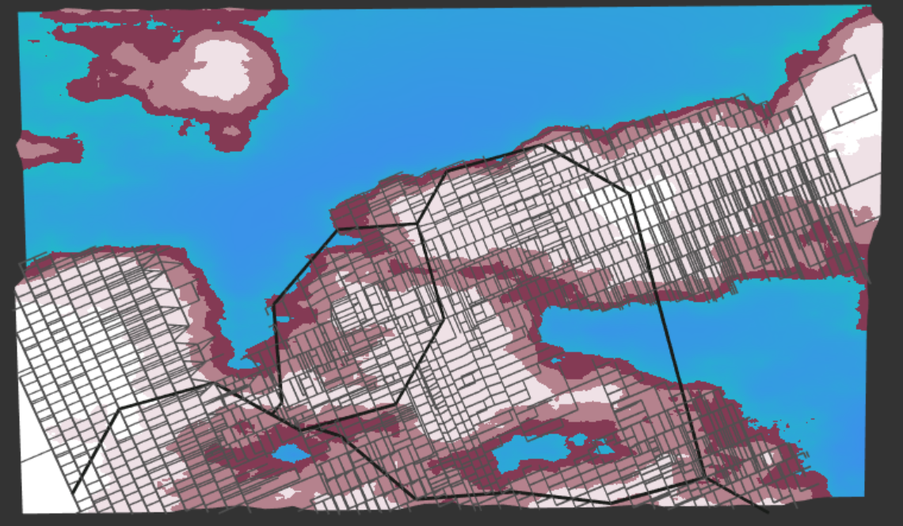
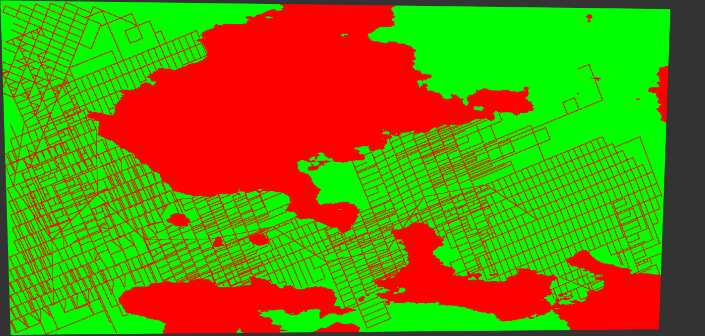
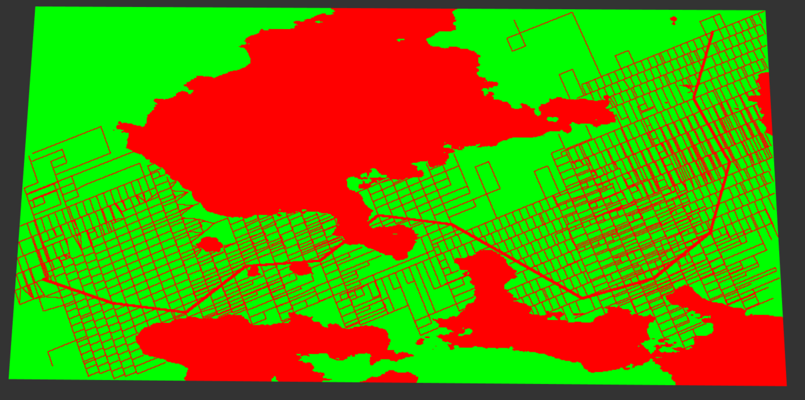
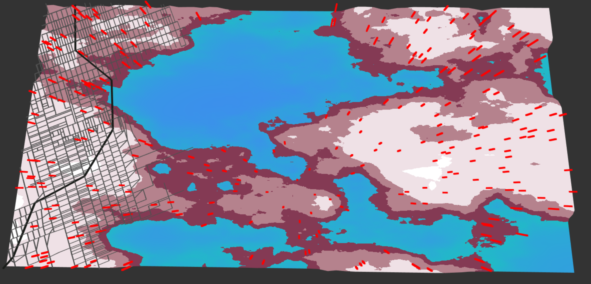
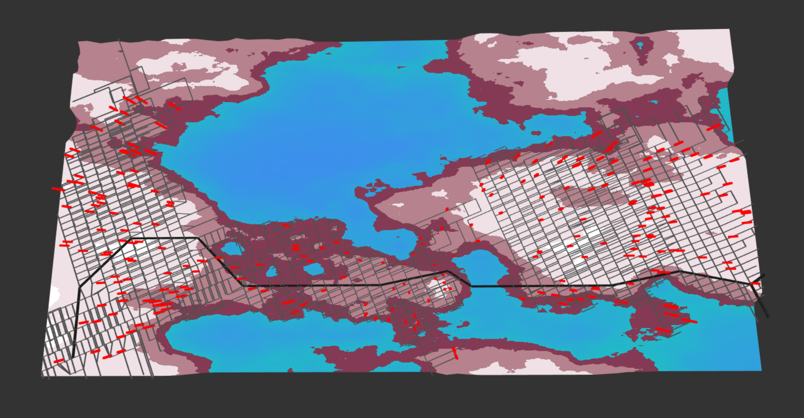

# Road Generation
**By Janine Liu / jliu99**

# Live GitHub demo
https://j9liu.github.io/citygen/

## Integration with Road Network

This project builts off of the road generator assigned last week. The terrain is visualized with a high resolution plane with two elevation levels: one for water, and one for mainland. The shore transitions gently between these two levels.

The roads are visualized as thin rectangular prisms that are placed at land level.

Like its road-creating counterpart, we define the space in which the roads are created as "cityspace." The bounds of cityspace are defined from (0, 0) in the bottom left corner to a specified (width, height) in the upper right corner. Our road generator operates within the coordinates of this cityspace to produce roads, then uses its own projection matrix to transform the network cityspace coordinates (from (0, 0) and (width, height)) to screen coordinates (from (-1, -1) and (1, 1)), such that they can be displayed in the 2D view as shown.

The CityGenerator operates within a grid, but this grid is much higher resolution than that of the road generator's. This is essentially used to "rasterize" the road and water data. Each cell checks for roads and/or water that intersects it, and if it is occupied by either element, it will not allow buildings to spawn in inside it. The following picture demonstrates the rasterization of the road network, with green marking valid spaces to place buildings, and red marking areas with roads and water.

The thickness of the roads can be adjusted such that they occupy more or less cells. For example, highways can be made to occupy more cells than regular streets.

## Building Generation

To place the buildings, a collection of randomly scattered 2D points is generated. With pure randomness and no constraints, the points will be spread across the map like shown.

This distribution is unideal, clearly, because it allows buildings to be spawned where there are no roads. To counteract this, I implemented a biasing measure that limits which random points are committed to the network. When a random point is generated, it checks for how many cells around it are occupied by roads. If that number is above a certain threshold, a building will be spawned at that point. This results in a point distribtion that more closely follows the road network.

Some points do not meet that road threshold, or otherwise fall in invalid cells. The generator keeps track of how many building positions have been created so far, and will attempt to regenerate new points. However, if no valid points have been

## Building Textures

## Future Improvements

## External Resources

In addition to the class lectures and powerpoints, I consulted a few external resources for this project:
https://stackoverflow.com/questions/36809778/typescript-interface-downcasting
https://stackoverflow.com/questions/44078205/how-to-check-the-object-type-on-runtime-in-typescript
https://thebookofshaders.com/edit.php#11/wood.frag for the wood-esque noise pattern
http://www.neilmendoza.com/glsl-rotation-about-an-arbitrary-axis/ for the formula for a rotation matrix around an arbitrary 3D axis